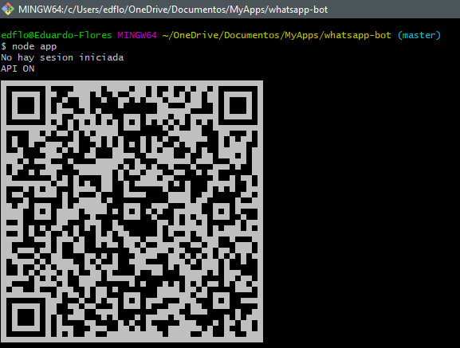
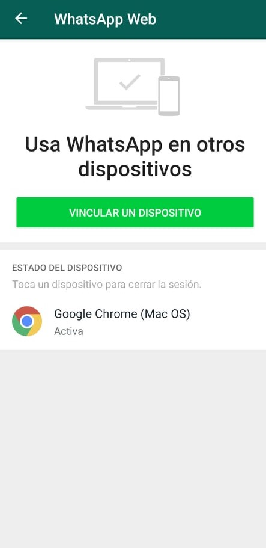

# Bot WhatsApp

## Descripcion
Responde de manera automática mediante un bot de WhatsApp desarrollado en NodeJS, con la libreria whatsapp-web.js 

## Tecnologias
NodeJS
ExpressJS
whatsapp-web.js
qrcode-terminal

## Capturas
### Generar código QR

### Conexión con WhatsApp Web

### Respondiendo mensajes mediante el bot
